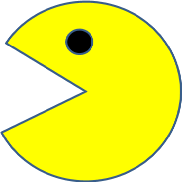

# Pac-Man
```Let Pac-Man travel inside the screen(maze).```

<html>
    
  <body>


    </img>
 
    </img>
    
    </img>
    
    </img>
    
   </body>
  
  </html>

 ## How to run
     1. Clone the repo (remember which folder the repo was cloned)
     2. Open Chrome.
     3. On Chrome, click File->Open File
     4. Select index.html
     
  ## License information 
  [MIT license](https://choosealicense.com/licenses/mit/)
